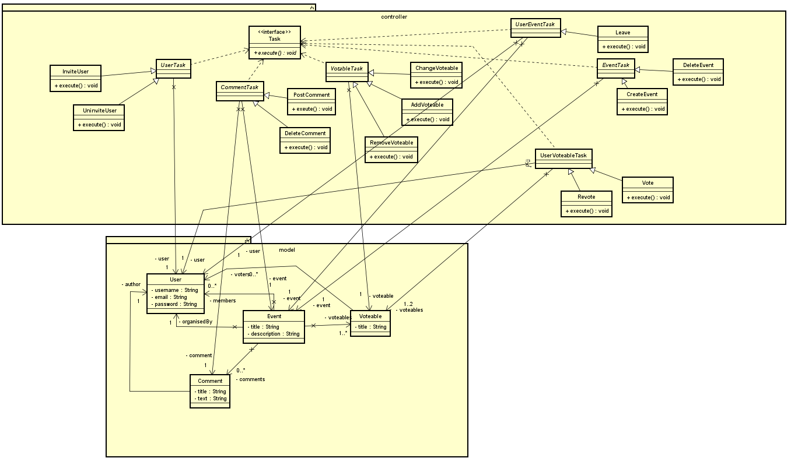

# Terminreservierungssystem

## Beschreibung

Es soll ein kollaboratives Terminvereinbarungssystem (ähnlich wie Doodle) erstellt werden, in dem sich Benutzerinnen koordinieren können. Folgende Anforderungen sollen dabei erfüllt werden:

**Benutzer**
* Neue Benutzerinnen können sich registrieren
* Existierende Benutzer können sich einloggen
* Man kann nach registrierten Benutzern im System suchen (über ihren Namen).
* Eine Benutzerin kann gleichzeitig eine Organisatorin und einfache Benutzerin sein.
* Jeder Benutzer kann sich die Events, die er organisiert, oder Events, an denen er teilnimmt, anzeigen lassen.

**Organisator**
* ist eine Benutzerin, der Events mit Namen und mehreren Termin- und Zeitvorschlägen erstellt und die Einladungen an einige registrierte Benutzer schickt
* darf den Namen, die Termine und Zeiten eines Events ändern, aber nur bevor sich einer der Benutzer zu dem Event angemeldet hat
* darf neue Benutzer zu seinen Events zusätzlich einladen
* darf eingeladene Benutzerinnen wieder löschen, bevor sich diese zu dem Event angemeldet haben
* darf die Events jederzeit löschen
* darf zu seinen Events Kommentare posten
* darf Kommentare zu seinen Events löschen (auch die von anderen Benutzern)
* Nachdem sich alle Benutzer zu einer Einladung angemeldet haben, darf der Organisator einen fixen Termin festlegen.

**Teilnehmer**
* wählt aus den vorgeschlagenen Terminen und Zeiten eines Events (eine Checkbox pro Zeitvorschlag reicht)
* darf seine Wahl ändern, bis ein fixer Termin existiert
* darf Kommentare zu Events, an denen er teilnimmt, posten

**Notifications**
* Ein Teilnehmer wird über jede neue/editierte/gelöschte Eventeinladung notifiziert.
* Weiters wird ein Teilnehmer notifiziert, sobald ein fixer Termin für ein Event festgelegt wird.
* Ein Organisator wird notifiziert, sobald sich alle Teilnehmer zu einem seiner Events angemeldet haben.
* Wenn eine Benutzerin zur Zeit einer Notification offline ist, darf diese nicht verloren gehen. Der Benutzer bekommt alle seine versäumten Notifications, sobald er online kommt.

## Aufgabenstellung

Entwickeln Sie eine grafische Applikation, welches das Terminvereinbarungssystem realisiert. Bei der Abgabe müssen Sie die Aufgabe auf mindestens drei Rechnern (mit mehreren gleichzeitig gestarteten Clients) präsentieren.

Beim Starten der Applikation müssen der gewünschte Benutzername, das Passwort und die Netzwerkadresse des Servers angegeben werden. Die Registrierung kann automatisch bei der ersten Anmeldung erfolgen.

Achten Sie bei der Implementierung auf die transaktionale Sicherheit. Überlegen Sie sich Situationen, in denen z.B. ein Benutzer versucht, eine Terminwahl zu einem in der Zwischenzeit gelöschten Event zu realisieren. Ihr Programm sollte auf solche und ähnliche Situationen entsprechend reagieren.

Beachten Sie bei der Implementierung, dass die Kommentare in derselben Reihenfolge aufgelistet werden müssen, in der diese von den einzelnen Benutzern abgeschickt wurden.
Sie müssen sich auch Gedanken über die Persistenz der Informationen machen. Wenn die Serverinstanz herunterfährt, muss der gesamte Inhalt dauerhaft abgelegt worden sein.

Es reicht ein einfaches, aber funktionales GUI. Sie müssen dafür ein entsprechendes Framework einsetzen.

## UML

## Zeitaufzeichnung 

## Git Usage
'''bash
git pull
work...
git add .
git commit -am "commit message"
git pull
git push

'''
